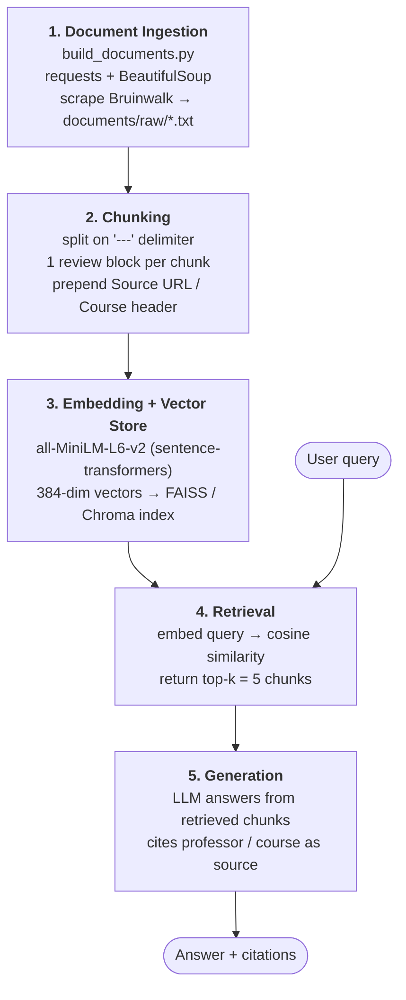

# Project 1 Planning: The Unofficial Guide

> Write this document before you write any pipeline code.
> Your spec and architecture diagram are what you'll use to direct AI tools (Claude, Copilot, etc.) to generate your implementation — the more specific they are, the more useful the generated code will be.
> Update the Retrieval Approach and Chunking Strategy sections if you change your approach during implementation.
> Update this file before starting any stretch features.

---

## Domain

<!-- What domain did you choose? Why is this knowledge valuable and hard to find through official channels? -->
Course and professor reviews would be a strong domain. Typically, the only information available about most university courses from official sources consists of course descriptions and syllabi. There is little to no info on the individual teaching styles of each professor and how accessible each individual course offering is. These insights are usually only found on student forums, where students who actually have taken certain classes discuss their experiences.
---

## Documents

<!-- List your specific sources: URLs, subreddit names, forum threads, or file descriptions.
     Aim for at least 10 sources that together cover different subtopics or perspectives within your domain. -->

| # | Source | Description | URL or location |
|---|--------|-------------|-----------------|
| 1 | Bruinwalk - CS 31 reviews snapshot | Extracted review text for workload, pace, and exam style (source: https://www.bruinwalk.com/classes/com-sci-31/) | documents/raw/bruinwalk_cs31_reviews.txt |
| 2 | Bruinwalk - CS 32 reviews snapshot | Extracted review text for CS 32 difficulty jump and project load (source: https://www.bruinwalk.com/classes/com-sci-32/) | documents/raw/bruinwalk_cs32_reviews.txt |
| 3 | Bruinwalk - CS 33 reviews snapshot | Extracted review text for lab intensity, quizzes, and grading strictness (source: https://www.bruinwalk.com/classes/com-sci-33/) | documents/raw/bruinwalk_cs33_reviews.txt |
| 4 | Bruinwalk - CS 35L reviews snapshot | Extracted review text for tooling friction and weekly time commitment (source: https://www.bruinwalk.com/classes/com-sci-35l/) | documents/raw/bruinwalk_cs35l_reviews.txt |
| 5 | Bruinwalk - professor reviews snapshot | Aggregated professor-specific comments for clarity, accessibility, and teaching style (source: Bruinwalk professor pages) | documents/raw/bruinwalk_professor_reviews.txt |
| 6 | Bruinwalk - CS professor 1 | Individual review page for a professor teaching a popular CS course | documents/raw/bruinwalk_prof_yutao_he.txt |
| 7 | Bruinwalk - CS professor 2 | Individual review page for a professor teaching a popular CS course | documents/raw/bruinwalk_prof_bruce_huang.txt |
| 8 | Bruinwalk - CS professor 3 | Individual review page for a professor teaching a popular CS course | documents/raw/bruinwalk_prof_ani_nahapetian.txt |
| 9 | Bruinwalk - CS professor 4 | Individual review page for a professor teaching a popular CS course | documents/raw/bruinwalk_prof_john_a_rohr.txt |
| 10 | Bruinwalk - CS professor 5 | Individual review page for a professor teaching a popular CS course | documents/raw/bruinwalk_prof_edwin_ambrosio.txt |
| 11 | Bruinwalk - CS professor 6 | Individual review page for a professor teaching a popular CS course | documents/raw/bruinwalk_prof_carey_nachenberg.txt |

> Note: Reddit r/ucla sources were dropped — Reddit now returns HTTP 403 to
> unauthenticated scrapers (even the `.json` API) and requires OAuth or a real
> browser session. The UCLA registrar catalog pages and the grades.natecation
> grade-distribution explorer were also dropped: both are JS-rendered, so a plain
> `requests` scrape only captured a title stub or a "Loading ..." placeholder.
> They were replaced with individual Bruinwalk review pages for professors who
> teach the most popular CS courses (the CS 31/32/33/35L intro series). Professors
> with no written reviews are skipped automatically.

---

## Chunking Strategy

<!-- How will you split documents into chunks?
     State your chunk size (in tokens or characters), overlap size, and explain why those
     numbers fit the structure of your documents.
     A review-heavy corpus warrants different chunking than a long FAQ. -->

**Chunk size:** One review block per chunk (target 500 characters / ~125 tokens, cap at ~1000 characters). Each raw document is already a series of self-contained review blocks separated by a `\n---\n` delimiter, so the chunker splits on that (and review blocks are typically around the length stated).

**Overlap:** 0 between distinct review blocks, since most reviews are not too lengthy and the `---` delimiter splits reviews informally. There will be a sentence-boundary fallback with ~100 char overlap only for oversized reviews.

**Reasoning:** The corpus is review-heavy. Every block is one professor's structured rating line (Easiness/Clarity/Workload/Helpfulness) plus a "Most Helpful Review" comment. A fixed-size sliding window would slice mid-review, separating a rating from its explanation and merging unrelated professors into one embedding, which hurts retrieval precision. Splitting on the natural `---` boundary keeps each professor's reviews independently retrievable, so overlap between blocks is unnecessary. We will prepend each document's `Source URL` / `Course:` header to every chunk so a retrieved review keeps its course/professor attribution and merge consecutive very short blocks (e.g. one-line reviews) to avoid close-to-empty embeddings.

---

## Retrieval Approach

<!-- Which embedding model are you using (e.g., all-MiniLM-L6-v2 via sentence-transformers)?
     How many chunks will you retrieve per query (top-k)?
     If you were deploying this for real users and cost wasn't a constraint, what tradeoffs
     would you weigh in choosing a different embedding model — context length, multilingual
     support, accuracy on domain-specific text, latency? -->

**Embedding model:** all-MiniLM-L6-v2 via sentence-transformers (free, runs locally, no API key)

**Top-k:** 5: 5 is large enough to capture agreement across reviews but small enough that unrelated professors/courses don't dilute the context.

**Production tradeoff reflection:** If cost weren't a constraint, I'd use a stronger model such as OpenAI `text-embedding-3-large` or a top MTEB model (e.g. `bge-large-en-v1.5`).

Larger models capture subtler sentiment and paraphrase, improving recall on differently-worded queries, which is the main reason to upgrade. Also, longer windows would matter if I switched to whole-professor-page chunks. Also, a multilingual model would matter if the corpus expanded to non-English sources. Given the small, English, short-text corpus, MiniLM is the right default for this use case.

---

## Evaluation Plan

<!-- List your 5 test questions with their expected correct answers.
     Questions should be specific enough that you can judge whether the system's response
     is right or wrong. "What are good dining halls?" is too vague.
     "What do students say about wait times at [dining hall name] during lunch?" is testable. -->

| # | Question | Expected answer |
|---|----------|-----------------|
| 1 | Which CS 31 professor do students most recommend, and why? | Bruce Huang since reviewers say he's super nice with grades, passionate about CS, gives extra-credit quizzes, and one explicitly recommends taking CS 31 with him over any other professor. |
| 2 | How do students describe Howard Stahl's CS 32 difficulty and grading compared to Smallberg/Nachenberg? | Easier than CS 32 with Smallberg/Nachenberg; projects (35%) are almost too easy, homework (15%) is straightforward, exams are fair, and he's lenient with regrades. Students say you can definitely get an A even though it's a weeder. |
| 3 | What do reviews say about Paul Eggert's CS 33 class? | Very negative on difficulty/easiness. One review warns "Leave now!! Wrote with blood and tear" unless you feel smarter than 99% of classmates; low easiness (1.4/5) and workload ratings. |
| 4 | What are students' main complaints about Glenn Reinman's CS 33 course? | Content-heavy pre-recorded flipped lectures that just read off slides, an extremely hard 40-minute midterm (class average 49, "lowest in his 20+ years"), concerns about academic-integrity obsession, and a harsh/nonsensical grading curve. |
| 5 | According to reviews, how do students feel about David Smallberg despite his lecture style? | They acknowledge his lectures can be boring (no slides, sometimes writes code in Word) but still call him "an absolute legend and a wonderful man" and want to boost his rating. |

---

## Anticipated Challenges

<!-- What could go wrong? Name at least two specific risks with reasoning.
     Consider: noisy or inconsistent documents, missing source attribution, off-topic
     retrieval, chunks that split key information across boundaries. -->

Reviews can be noisy and inconsistent. The corpus mixes in a non-English review (Chinese text under Nahapetian) and reviews spanning very different years (Eggert 2017 vs. Batista 2026). These produce weak or unsearchable embeddings and can be mitigated by merging/skipping near-empty blocks and keeping each review's term/year in the chunk so dated opinions can be caveated. Also, reviews often name other professors, so merged chunks or broad retrieval can credit one professor's sentiment to another.

---

## Architecture

<!-- Draw a diagram of your pipeline showing the five stages:
     Document Ingestion → Chunking → Embedding + Vector Store → Retrieval → Generation
     Label each stage with the tool or library you're using.
     You can use ASCII art, a Mermaid diagram, or embed a sketch as an image.
     You'll use this diagram as context when prompting AI tools to implement each stage. -->

---

## AI Tool Plan

<!-- For each part of the pipeline below, describe:
     - Which AI tool you plan to use (Claude, Copilot, ChatGPT, etc.)
     - What you'll give it as input (which sections of this planning.md, which requirements)
     - What you expect it to produce
     - How you'll verify the output matches your spec

     "I'll use AI to help me code" is not a plan.
     "I'll give Claude my Chunking Strategy section and ask it to implement chunk_text()
     with my specified chunk size and overlap" is a plan. -->
     I will use Claude Opus 4.8 to assist with this project. For each part, I will include the planning.md, but I will highlight specific sections (e.g. chunking) when working on the relevant parts.I expect parts without additional context provided to produce more general results.

**Milestone 3 — Ingestion and chunking:**
I'll give Claude the Chunking Strategy section and ask it to implement a `chunk_text()` that splits the raw files on the `---` delimiter, prepends the Source URL/Course header, and caps the chunk size. I'll verify by asserting each chunk has one `Professor:` line and is within the size cap.

**Milestone 4 — Embedding and retrieval:**
I'll give Claude the Retrieval Approach section and ask it to embed chunks with all-MiniLM-L6-v2 into a vector store and return top-5 for a query. I'll verify by running my 5 eval questions and checking the expected professor/course appears in the retrieved chunks.

**Milestone 5 — Generation and interface:**
I'll give Claude the Evaluation Plan and ask it to build a query interface that answers from retrieved chunks and cites the professor/course. I'll verify by comparing answers against my Expected answer column and confirming an out-of-corpus question returns "no information" instead of a hallucination.
